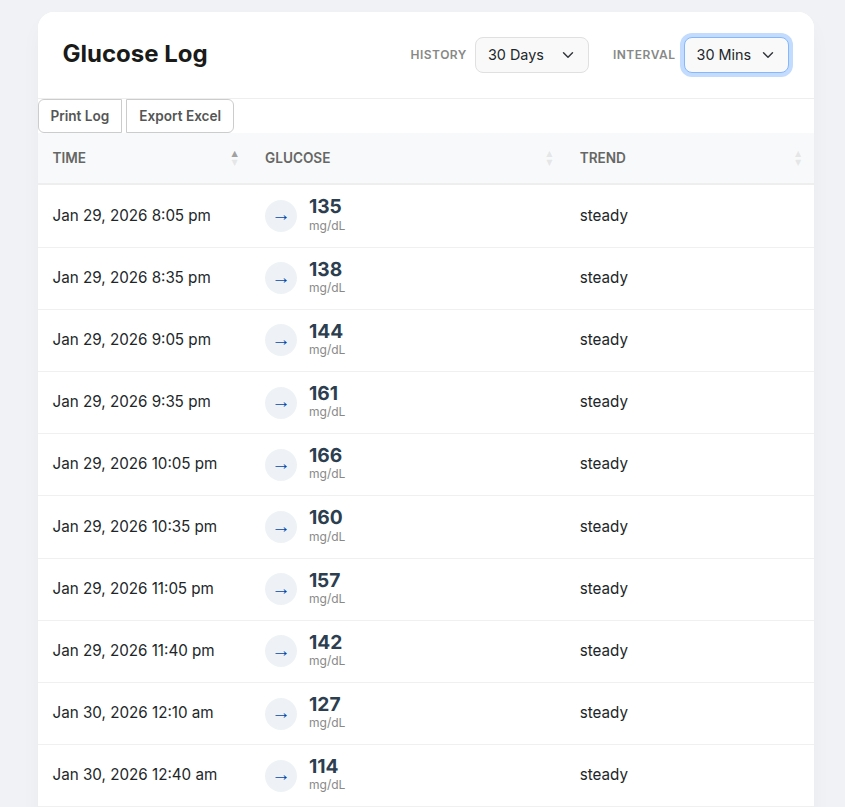

# 📈 Dexcom Glucose Logger (G4/G5/G6/G7)

A self-hosted, mobile-friendly dashboard that logs Dexcom (G4/G5/G6/G7) glucose readings to a local database.


> **Why this exists:** The official Dexcom Share API limits data retrieval to the last 24 hours. This application bypasses that limitation by automatically syncing readings to a local SQLite database, giving you ownership of your long-term health history.

---

## ✨ Features

* **📊 Long-Term History:** Automatically bypasses the 24-hour API limit by saving every reading to a local `glucose.db` file.
* **📱 Mobile-First Design:** A responsive, modern UI designed specifically for checking trends on your phone.
* **🔄 Auto-Sync:** A background worker wakes up every 30 minutes to fetch new data and fill in any gaps.
* **🖨️ Printer Friendly:** One-click "Print" button formats the data perfectly for doctor visits.
* **📉 Smart Intervals:** View every reading (5-min) or smooth the data (15-min, 30-min, 1-hour intervals).

---

## 🖼️ Screenshots



_The dashboard provides a clean, sortable view of your glucose trends, designed to be readable at a glance._

---

## ✅ Prerequisites

Before running this logger, ensure:
1.  **Dexcom Share is Enabled:** The main Dexcom account **must** have the "Share" feature enabled in the mobile app.
2.  **At Least One Follower:** Dexcom often requires at least one active follower (or pending invitation) for the Share API to function.

---

## 🚀 Quick Start

The easiest way to run this is with Docker Compose. You do not need to clone the repository code, you only need the configuration file.

1.  **Create a folder** for the project:
    ```bash
    mkdir dexcom-logger
    cd dexcom-logger
    ```

2.  **Create a `compose.yaml` file:**
    Create a file named `compose.yaml` and paste the following:

  ```yaml

services:
  web:  # <--- MUST be indented (2 spaces)
    image: ghcr.io/nuken/dexcom-glucose-logger:latest
    container_name: dexcom-web
    restart: unless-stopped
    ports:
      - 5000:5000
    environment:
      - DEXCOM_USER=your_username_here
      - DEXCOM_PASS=your_password_here
      - DEXCOM_OUS=False
      - TZ=America/New_York
    volumes:
      - glucose_data:/app/data

volumes:
  glucose_data:
```
  
3.  **Run it:**
    ```bash
    docker compose up -d
    ```

4.  **Access the Dashboard:**
    Open your browser and go to `http://your-server-ip:5000`

---

## 🖥️ Portainer / Dockge

If you use a dashboard like Portainer or Dockge, you can deploy this as a **Stack**.

**Stack Configuration:**

```yaml

services:
  web:  # <--- MUST be indented (2 spaces)
    image: ghcr.io/nuken/dexcom-glucose-logger:latest
    container_name: dexcom-web
    restart: unless-stopped
    ports:
      - 5000:5000
    environment:
      - DEXCOM_USER=your_username_here
      - DEXCOM_PASS=your_password_here
      - DEXCOM_OUS=False
      - TZ=America/New_York
    volumes:
      - glucose_data:/app/data

volumes:
  glucose_data:

```

---

## ⚙️ Configuration

You can configure the application using environment variables in `compose.yaml`:

| Variable | Description | Default |
| :--- | :--- | :--- |
| `DEXCOM_USER` | **Required.** Your Dexcom account username. | `None` |
| `DEXCOM_PASS` | **Required.** Your Dexcom account password. | `None` |
| `DEXCOM_OUS` | Set to `True` if you live outside the US (International Account). | `False` |
| `TZ` | Sets the timezone for the logs (e.g., `America/New_York`). | `UTC` |

---

## 🛠️ Troubleshooting

**The time is wrong/UTC:**
Ensure you have set the `TZ` environment variable in your `compose.yaml` to your local timezone (e.g., `America/Chicago`).

**I don't see data older than 24 hours:**
When you first install the logger, it can only "see" what Dexcom allows (the last 24 hours). As you leave the container running, it will build up your history day by day. In a week, you will have 7 days of data!

**"Background Sync Failed" in logs:**
This usually happens if the password is incorrect or Dexcom servers are temporarily down. The logger will automatically retry in 30 minutes.

---

## 🔒 Privacy & Data

This application stores your personal health data in a local file named `glucose.db` located in the application folder.
* **Ownership:** You own this data. It never leaves your server.
* **Backup:** We recommend backing up the `glucose.db` file regularly.
* **Security:** Ensure your server is secure and not exposed to the public internet without proper authentication (like a VPN or Authelia).

---

## 🤝 Contributing

Contributions, issues, and feature requests are welcome! Feel free to check the [issues page](https://github.com/nuken/dexcom-glucose-logger/issues).

## Acknowledgements

* **[pydexcom](https://github.com/gagebenne/pydexcom):** This project relies on the excellent library by [Gage Benne](https://github.com/gagebenne) to communicate with the Dexcom Share API.

## 📄 License

This project is [MIT](LICENSE) licensed.


